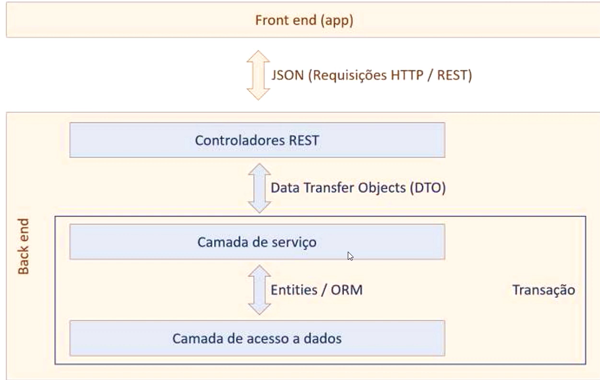
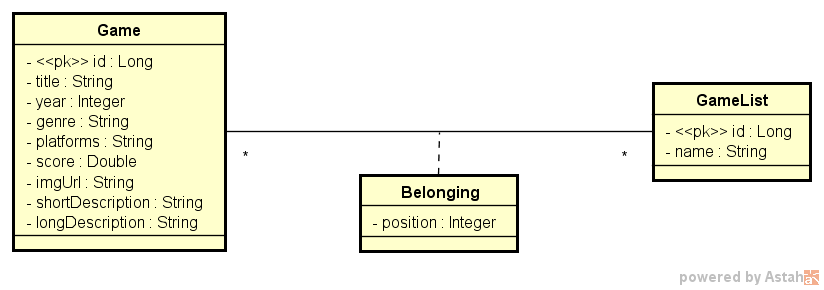

<h1 align="center"><b> DSList</b></h1>

<div align="center">


</div>

## 📚 About

The project **DSList** consists of providing a REST API for managing Games separated by type and has a functionality for repositioning a game within the list.
This project was developed during the Java Spring event, an event organized by [DevSuperior](https://github.com/devsuperior).

Once on the front-end, it allows the user to position the games in a list by clicking and dragging, which is the logic used in this case study.

The system follows the API format adopting the **REST** pattern and handles **HTTP/REST** requests through **GET** and **POST** methods.

In practice, **DSList** games send and process game information through the use of Spring tools, SQL and databases - H2 (for testing) and PostgresSQL (Approval and Production environment);

The data transaction takes place in three layers:

1) **Rest + DTO Controllers:** Data Transfer Objects - the "backend gateway" - it makes the API available.

2) **Service Layer:** Where the business logic implementation takes place;

3) **Data Access Layer:** mediated by entities and **ORM** (Object Relational Mapping).

## 📙 Layer Pattern



## 📘 Domain Model



## 📝 Technologies & Languages Used

- **Java**
- **Spring Boot**
- **Maven**
- **JPA/Hibernate**
- **H2 Database**
- **PostgreSQL**
- **Docker**
- **Postman**

## 🐳 How To Run Locally

I implemented a modification in the DSList application to be fully containerized using Docker, which allowed encapsulating both the Java Spring application and the PostgreSQL database in a homologated environment. Now, with just one simple command, it is possible to upload the complete application and start testing quickly and efficiently. This containerization approach ensures greater portability, facilitates deployment and ensures consistency in the approval environment.

```bash
# Clone this repo
$ git clone https://github.com/lucasferreiraz/dslist

# Enter the folder
$ cd dslist

# Run docker
$ docker compose up
```
## 📷 Demonstration


<p align="center" style="font-weight:bolder">
    Developed with 💛 by <a href="https://github.com/lucasferreiraz">Lucas Ferreira</a>
</p>